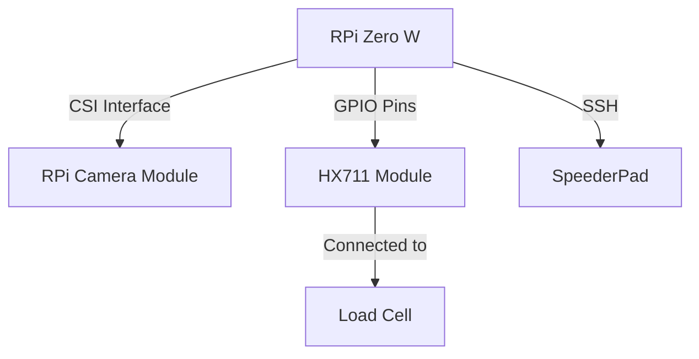

# filament-tracker
Automated tracker of filament on 3d printer. 

## Overview
The idea for this project is to create a system that automatically tracks what filament is used for which prints. These are the key features of the system. 

+ Detect filament roll in printer from QR code
+ Record initial weight of filament roll
+ Measure current weight of filament roll and determine length of remaining filament
+ Track remaining filament of all rolls in a database
+ Allow additional descriptions of filament to be entered in the database
+ Detect jobs on 3d printer and record what is printed with the current filament roll

## Technologies
This project is mostly and integration of other existing projects with the exception of the database tracking of filament (unless I find a project for that). 

Here is a list of what is needed for the above requirements. 

* QR Code creator for printing sheets of QR Code stickers to place on filament rolls
* QR Code reader for scanning the current filament roll on the printer
* Load Cell reader for weighing filament rolls
* Database for tracking filament rolls and print jobs

Some things are unique to this project. 

* Monitoring 3d printer for print jobs
* Database schema for filament rolls and print jobs

## Hardware
This project relies on specific hardware to automatically monitor filament rolls.

- Raspberry Pi Zero W
- RPI Camera TBD
- 3kg Digital Load Cell Weight Sensor
- HX711 AD Amplifier Weighing Sensor Module
- FLSun V400 3D Printer with SpeederPad

## Hardware Design
This is the hardware design.

## Software Technologies
### Database
The database requirements should be very lite and is intended to run on a raspberry pi zero w, so the obviour choice is SQLite.

There are three objects stored in the database. 
- Unique Filament Types - brand / type / colour / other attributes
- Specific Filament Rolls - an instance of a type of filament, cost, initial weight, current weight
- Distinct Print Jobs - STL file, filament roll, date and time, completed or aborted, filament used

### QR Codes

